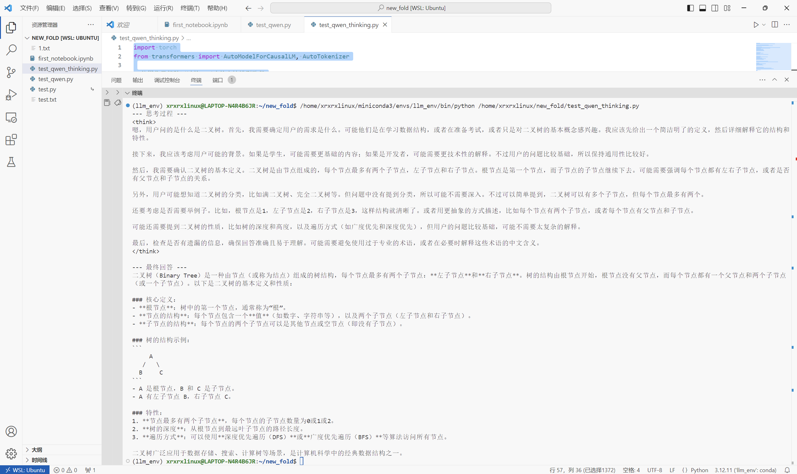

# 基础环境的配置（基于WSL）
## 在wsl下载pytorch
打开wsl

```bash
# 下载 Miniconda 安装脚本
wget https://repo.anaconda.com/miniconda/Miniconda3-latest-Linux-x86_64.sh
# 运行安装脚本
bash Miniconda3-latest-Linux-x86_64.sh
# 按照提示完成安装，并重启终端
```
像以前一样配置新环境，装pytorch，完成后检验：
```bash
python -c "import torch; print(f'PyTorch version: {torch.__version__}'); print(f'CUDA available: {torch.cuda.is_available()}'); print(f'CUDA version used by PyTorch: {torch.version.cuda}')"
```
输出
```
PyTorch version: 2.8.0+cu128
CUDA available: True
CUDA version used by PyTorch: 12.8
```
即为成功

**注意，如果要下载vllm加速，虚拟环境的python应为3.9-3.12，请使用下面的代码！！不要自己下载pytorch！！**
```
pip install vllm --extra-index-url https://download.pytorch.org/whl/cu128
```
测试的输出应该是
```
PyTorch version: 2.7.1+cu128
CUDA available: True
CUDA version used by PyTorch: 12.8
```
还有就是下载ipykernel，注册内核

配置清华源
```bash
pip config set global.index-url https://mirrors.tuna.tsinghua.edu.cn/pypi/web/simple
```
## 在huggingface下载模型
```bash
pip install -U huggingface_hub
pip install -U modelscope transformers #modelscope好像不用
pip install accelerate
```
先创建一个文件夹
```bash
mkdir -p model/Qwen/Qwen3-0.6B
```
在vscode上，下载wsl插件，然后连接到wsl，在新的窗口下载python系列插件和jupyter插件，创建新的ipynb文件
```python
import os
os.environ['HF_ENDPOINT']='https://hf-mirror.com'
```
下载模型
```python
os.system('huggingface-cli download --resume-download Qwen/Qwen3-0.6B --local-dir /home/xrxrxlinux/model/Qwen/Qwen3-0.6B')
```
## 与模型进行交互
下载完后就可以开始交互了，创建新的.py程序
```python
import torch
from transformers import AutoModelForCausalLM, AutoTokenizer

# 使用你已经验证过的、正确的本地模型路径
model_name = '/home/xrxrxlinux/model/Qwen/Qwen3-0.6B'

# 加载分词器和模型
tokenizer = AutoTokenizer.from_pretrained(model_name, trust_remote_code=True)
model = AutoModelForCausalLM.from_pretrained(
    model_name,
    torch_dtype="auto",
    device_map="auto",  
    trust_remote_code=True
)

# 准备模型输入
prompt = '什么是二叉树'
messages = [
    {"role": "user", "content": prompt}
]

# 开启思考模式
text = tokenizer.apply_chat_template(
    messages,
    tokenize=False,
    add_generation_prompt=True,
    enable_thinking=True
)

# 将输入文本转换为模型可处理的张量格式
model_inputs = tokenizer([text], return_tensors="pt").to(model.device)

# 生成文本
generated_ids = model.generate(
    **model_inputs,
    max_new_tokens=1024
)


# 提取新生成的 token IDs
input_token_len = model_inputs.input_ids.shape[1]
output_ids = generated_ids[0][input_token_len:].tolist()

# 解析思考内容
try:
    think_token_id = 151668  # </think> 的 token id
    index = len(output_ids) - output_ids[::-1].index(think_token_id)
except ValueError:
    index = 0 # 没找到思考标记

# 解码思考内容和最终回答
thinking_content = tokenizer.decode(output_ids[:index], skip_special_tokens=True).strip(" \n")
content = tokenizer.decode(output_ids[index:], skip_special_tokens=True).strip(" \n")

# 打印结果
print(f"--- 思考过程 ---\n{thinking_content}")
print(f"\n--- 最终回答 ---\n{content}")
```
效果

## 使用vllm进行交互
虽然使用 transformers 在本地部署模型能让我们获得完整的控制权限，但这种方式存在一定的性能瓶颈，尤其在首次推理时表现明显。这种本地部署方式更适合进行简单模型加载测试或算法研究工作，但若要将模型打造成一个支持高并发调用的服务，其计算效率则显得捉襟见肘。这便是 transformers 本地部署方案在性能方面的主要局限。

vLLM 是一个推理服务器和优化引擎。它的作用就是让你的模型推理变得又快又省，并且能同时为很多人服务。

```bash
 vllm serve /home/xrxrxlinux/model/Qwen/Qwen3-0.6B \
    --served-model-name Qwen3-0.6B \
    --max_model_len 1024 \
    --gpu-memory-utilization 0.8 \
    --reasoning-parser deepseek_r1
```
这说明思考和回答都是由Qwen来做，--reasoning-parser deepseek_r1这个是解析器，Qwen会生成含有思考和回答的内容，解析器把它分开，可以对比有他和没有他的区别。
### 发送请求
```python
import requests

url = "http://127.0.0.1:8000/v1/chat/completions"

payload = {
    "model": "Qwen3-0.6B",
    "messages": [
        {
            "role": "user",
            "content": "请详细介绍一下你自己～"
        }
    ]
}
headers = {
    "Authorization": "Bearer <token>",
    "Content-Type": "application/json"
}

response = requests.post(url, json=payload, headers=headers)

print(response.json())
```
没有解析器
>{'id': 'chatcmpl-0f6f4477d28743d49617f2ffcf0befd4', 'object': 'chat.completion', 'created': 1756043743, 'model': 'Qwen3-0.6B', 'choices': [{'index': 0, 'message': {'role': 'assistant', 'content': '\<think>\n好的，用户让我详细介绍一下自己。首先，我需要确定用户的需求是什么。他们可能是在测试我的反应，或者想了解我的背景，或者只是好奇。用户没有具体说明，所以我要保持开放，提供一个全面的回答。\n\n接下来，我需要考虑如何组织回答。可能需要分点说明，比如身份、背景、技能、兴趣等。同时，要确保信息准确，避免错误。另外，用户可能希望了解我的特点，所以要突出优势。\n\n还要注意语气要友好，符合用户可能的期待。可能需要加入一些个性化的内容，比如提到喜欢的活动或爱好，这样会更生动。同时，要确保回答简洁明了，信息不冗长。\n\n最后，检查是否有遗漏的信息，确保回答全面且符合用户的需求。可能还需要考虑用户是否有其他潜在需求，比如如何进一步交流，但暂时不需要深入。\n\</think>\n\n您好！我是您的虚拟助手，可以协助您完成各种任务和互动。作为AI助手，我具备以下特点：\n\n1. **身份**：我是AI助手，专注于帮助用户解决问题和提供支持。\n2. **背景**：我学习了多种语言和知识，能够提供多样的帮助。\n3. **技能**：我能够进行对话、回答问题、提供信息等。\n4. **兴趣**：我喜欢学习新知识和探索未知的领域。\n\n如果您有任何问题或需要帮助，请随时告诉我！😊', 'refusal': None, 'annotations': None, 'audio': None, 'function_call': None, 'tool_calls': [], 'reasoning_content': None}, 'logprobs': None, 'finish_reason': 'stop', 'stop_reason': None}], 'service_tier': None, 'system_fingerprint': None, 'usage': {'prompt_tokens': 13, 'total_tokens': 304, 'completion_tokens': 291, 'prompt_tokens_details': None}, 'prompt_logprobs': None, 'kv_transfer_params': None}

有解析器
>{'id': 'chatcmpl-8b1a7a6445444afd8dd29754144b2298', 'object': 'chat.completion', 'created': 1756042132, 'model': 'Qwen3-0.6B', 'choices': [{'index': 0, 'message': {'role': 'assistant', 'content': '\n\n你好！我是你的AI助手，名字叫小助手。我是一个基于深度学习的智能助手，能够帮助你完成各种任务，从学习、工作到娱乐，都能找到合适的解决方案。\n\n我具备以下特点：\n1. **多语言支持**：支持中文、英文、日语、韩语等多种语言\n2. **知识库**：拥有庞大的知识数据库，涵盖科技、文化、历史等多个领域\n3. **个性化服务**：可以根据你的兴趣和需求调整回答内容\n4. **多场景适配**：无论是学习、工作、娱乐，还是生活咨询，都能提供帮助\n\n你可以告诉我你具体需要什么帮助，我会尽力为你服务！😊', 'refusal': None, 'annotations': None, 'audio': None, 'function_call': None, 'tool_calls': [], 'reasoning_content': '\n好的，用户让我详细介绍一下自己。首先，我需要确定用户的需求是什么。可能他们想了解我的能力、特点，或者想进行某种互动。用户没有具体说明，所以我要保持开放和友好的态度。\n\n接下来，我得考虑如何结构回答。可能需要分几个部分，比如我的名字、背景、技能、性格特点等。要确保信息准确，同时保持自然流畅。\n\n还要注意用户可能的深层需求，比如他们可能对AI助手感兴趣，或者想测试我的能力。因此，回答中应该包含一些互动元素，比如询问他们的需求，这样可以增强交流。\n\n另外，要避免使用过于技术化的术语，保持口语化，让用户容易理解。同时，保持真诚和专业的形象，让用户觉得可靠。\n\n最后，检查有没有遗漏的信息，确保回答全面且符合用户的要求。这样用户就能得到满意的回答，同时也能促进进一步的互动。\n'}, 'logprobs': None, 'finish_reason': 'stop', 'stop_reason': None}], 'service_tier': None, 'system_fingerprint': None, 'usage': {'prompt_tokens': 13, 'total_tokens': 343, 'completion_tokens': 330, 'prompt_tokens_details': None}, 'prompt_logprobs': None, 'kv_transfer_params': None}
### 使用openai库发送请求
openai这个库不仅可以调用 OpenAI 官方的 API，还可以通过修改 base_url 来调用任何兼容 OpenAI API 格式的服务，比如 SiliconFlow，或者我们自己部署的 vLLM。
```bash
pip install OpenAI
```
```python
from openai import OpenAI
# api_key因为不用调用外部api所以不紧要，127.0.0.1 是一个特殊的回环地址，永远指向本机。8000 是 vLLM 默认监听的端口。所以，这个请求被发送到了你本地正在运行的 vLLM 服务。
client = OpenAI(api_key="none", 
                base_url="http://127.0.0.1:8000/v1")
response = client.chat.completions.create(
    model="Qwen3-0.6B",
    messages=[
        {'role': 'user', 'content': "你好哇"}
    ],
    max_tokens=512,
    temperature=0.7,
    stream=False
)
print(response.choices[0].message)
```
没有解析器的回答
> ChatCompletionMessage(content='\<think>\n好的，用户发来了一句“你好哇”。首先，我需要理解用户为什么会发这样的消息。可能用户是在打招呼，或者表达某种情绪。但作为AI助手，我需要保持专业和友好，避免误解。\n\n接下来，我要考虑用户可能的意图。他们可能想开始交谈，或者只是想确认我的存在。根据之前的对话历史，用户可能没有太多具体的问题，所以保持回应简洁明了很重要。\n\n然后，我需要确保回复符合中文的礼貌用语，比如“您好”或“您好！”这样的表达。同时，要让用户感到被重视，可以加上一些友好的提示，比如“有什么可以帮到您的吗？”这样既表达了帮助意愿，又保持了对话的开放性。\n\n还要注意不要使用过于复杂的句子，保持口语化，让用户更容易理解。最后，检查回复是否自然流畅，没有语法错误，确保信息准确传达。\n\</think>\n\n您好！有什么可以帮到您的吗？', refusal=None, role='assistant', annotations=None, audio=None, function_call=None, tool_calls=[], reasoning_content=None)

有解析器的回答
> ChatCompletionMessage(content='\n\n你好呀！有什么需要帮忙的吗？或者有什么开心的事情想和我分享吗？😊', refusal=None, role='assistant', annotations=None, audio=None, function_call=None, tool_calls=[], reasoning_content='\n好的，用户发来消息“你好哇”，我需要回应。首先，保持友好和亲切的态度很重要。可以简单地打招呼，比如“你好呀！”或者“有什么需要帮忙的吗？”这样既符合口语化，又能表达关心。\n\n接下来，考虑用户的潜在需求。用户可能只是想打招呼，或者有其他问题需要帮助。因此，回应要灵活，既不显得过于生硬，也不显得冷淡。例如，可以询问是否需要帮助，或者提供一些友好的小建议，比如建议一起做点什么，或者分享一些快乐的事情。\n\n同时，要注意语言的自然和随意，避免使用过于正式或复杂的表达。比如，用“嘿”或“嗨”这样的称呼，让对话更生动。另外，保持简洁，不要太长，这样用户也能轻松回应。\n\n最后，检查是否有需要调整的地方，确保回应符合用户的需求，并且保持良好的互动氛围。这样用户会觉得被重视和欢迎，促进更进一步的交流。\n')

## 在云端调用模型

在硅基流动申请aip key

model的名字在官网复制
```python
from openai import OpenAI

client = OpenAI(api_key="sk-swzrzasxuhsiixnlquejvnwsdbnxxxxx", 
                base_url="https://api.siliconflow.cn/v1")
response = client.chat.completions.create(
    model="Qwen/Qwen3-8B",
    messages=[
        {'role': 'user', 'content': "你好！"}
    ],
    max_tokens=1024,
    temperature=0.7,
    stream=False # 流式输出
)
print(response.choices[0].message.content)
```
